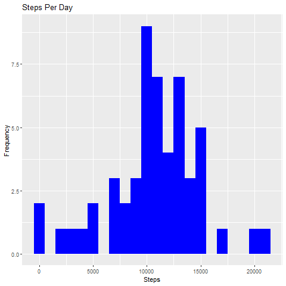
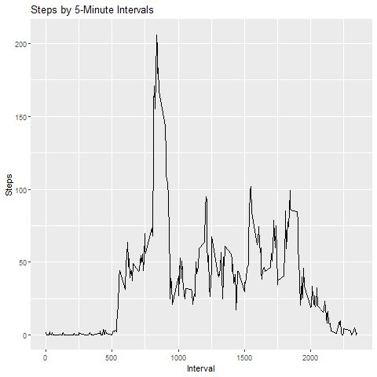
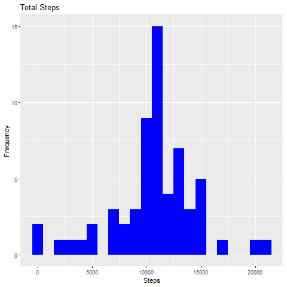
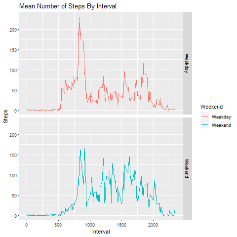

# Reproducible Research Week 1 Project

## Loading and preprocessing the data
```{r}
data <- read.csv("activity.csv")
data$date <- as.Date(as.character(data$date))
clean_data <- data[!is.na(data$steps),]
```

## What is mean total number of steps taken per day?
```{r}
library(ggplot2)
data_by_day <- aggregate(data$steps, by=list(data$date), FUN=sum)
colnames(data_by_day) <- c("Date", "Steps")
ggplot(data_by_day, aes(x=Steps)) +
  geom_histogram(fill="blue", binwidth=1000) +
  labs(title="Steps Per Day", x="Steps", y="Frequency")
mean(data_by_day$Steps, na.rm=TRUE)
median(data_by_day$Steps, na.rm=TRUE)
```
<!-- -->

## What is the average daily activity pattern?
```{r}
mean_data <- aggregate(x=list(Steps=data$steps), by=list(interval=data$interval), FUN=mean, na.rm=TRUE)
ggplot(mean_data, aes(x=interval, y=Steps)) +
  geom_line() +
  labs(title="Steps by 5-Minute Intervals", x="Interval", y="Steps")
mean_data[which.max(mean_data$interval),]
```
<!-- -->

## Imputing missing values
```{r}
missing <- is.na(data$steps)
clean_data <- data[!is.na(data$steps),]
mean_per_interval <- tapply(clean_data$steps, clean_data$interval, FUN=mean, na.rm=TRUE, simplify=TRUE)
data$steps[missing] <- mean_per_interval[as.character(data$interval[missing])]
sum(missing)
sum(is.na(data$steps))
data_by_day <- aggregate(data$steps, by=list(data$date), FUN=sum)
colnames(data_by_day) <- c("Date", "Steps")
ggplot(data_by_day, aes(x=Steps)) +
  geom_histogram(fill="blue", binwidth=1000) +
  labs(title="Total Steps", x="Steps", y="Frequency")
mean(data_by_day$Steps)
median(data_by_day$Steps)
```
<!-- -->

## Are there differences between weekdays and weekends?
```{r}
data$weekday <- weekdays(data$date)
data$weekend <- ifelse(data$weekday == "Saturday" | data$weekday == "Sunday", "Weekend", "Weekday") 
mean_data <- aggregate(data$steps, by=list(data$weekend, data$interval), FUN=mean)
colnames(mean_data) <- c("Weekend", "Interval", "Steps")
ggplot(mean_data, aes(x=Interval, y=Steps, color=Weekend)) +
  geom_line() +
  facet_grid(Weekend ~ .) +
  labs(title="Mean Number of Steps By Interval", x="Interval", y="Steps")
```
<!-- -->
